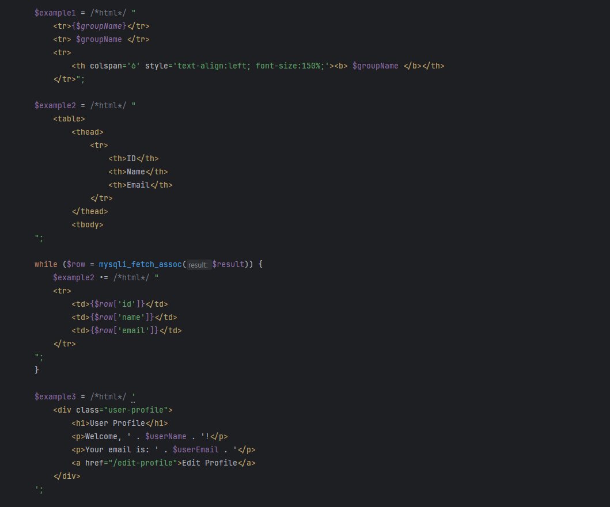
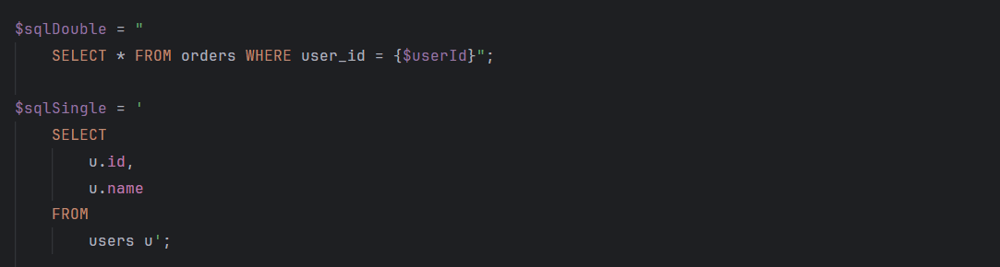

# PHP String Syntax

**PHP String Syntax** is a Visual Studio Code extension that highlights SQL, HTML, and JavaScript embedded in PHP strings. The extension automatically infers HTML and SQL content by default, while also supporting explicit language markers (`/*sql*/`, `/*html*/`, and `/*js*/`) to identify and apply syntax highlighting to SQL queries, HTML content, and JavaScript code.

## Features

- **Automatic Language Detection**: Infers and highlights HTML and SQL content in PHP strings without requiring explicit markers.
- **Explicit Language Markers**: Supports `/*sql*/`, `/*html*/`, and `/*js*/` comments for explicit language specification when needed.
- **Compatibility with Other Editors**: The use of language markers does not interfere with syntax in other editors or IDEs.
- **Multiline String Support**: Works seamlessly with queries, HTML content, and JavaScript code spread across multiple lines.

### Current Support

- **HTML** (auto-detected and with explicit marker)
- **SQL** (auto-detected and with explicit marker)
- **JavaScript** (with explicit marker)

### Example

#### HTML Example (Explicit)


#### SQL Example (Explicit)


#### JavaScript Example (Explicit)
```php
$jsCode = /*js*/ "console.log('Hello, World!');";
```

Visual Studio Code will apply SQL, HTML, and JavaScript syntax highlighting to the content of the strings, improving readability and streamlining development.

### Customization

Some themes will require customizing the appearance of embedded code by adding TextMate scopes to your VS Code configuration. Below is a basic configuration for the `settings.json` file, but you can add more scopes as needed for your specific customization requirements:

```json
"editor.tokenColorCustomizations": {
    "textMateRules": [
      {
        "scope": [
          "string.quoted.double.php text.html.embedded.php",
          "string.quoted.single.php text.html.embedded.php",
          "string.quoted.double.php punctuation.section.array",
          "string.quoted.single.php punctuation.section.array",
          "string.quoted.double.php punctuation.definition.arguments",
          "string.quoted.single.php punctuation.definition.arguments"
        ],
        "settings": {
          "foreground": "#BCBEC4"
        }
      },
      {
        "scope": [
          "string.quoted.double.php punctuation.definition.tag",
          "string.quoted.single.php punctuation.definition.tag"
        ],
        "settings": {
          "foreground": "#ABB2BF"
        }
      }
    ]
}
```

You can modify the hex color values to match your preferred color scheme.

### Installation

1. Open Visual Studio Code.
2. Go to the Extensions view (Ctrl+Shift+X or Cmd+Shift+X on Mac).
3. Search for **PHP String Syntax**.
4. Click "Install."

### Feedback

Your feedback is invaluable! If you encounter any issues or have suggestions for improvements, please [report them](https://github.com/ericgomez/vscode-php-string-syntax/issues) here.

### License

This extension is licensed under the MIT License. See the [LICENSE](./LICENSE) file for details.

Enjoy coding with **PHP String Syntax**! 🚀
