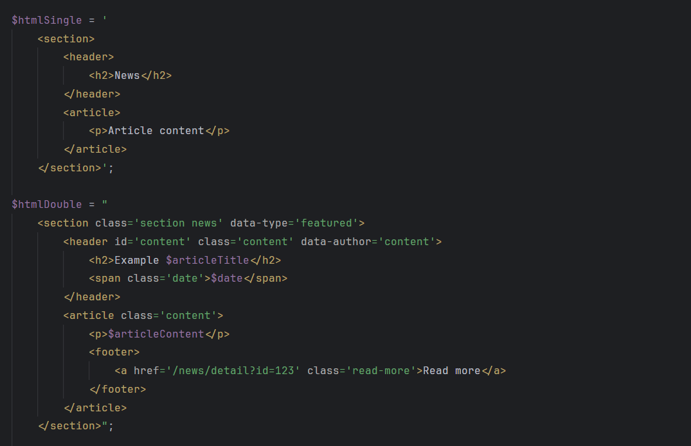

# PHP String Syntax

**PHP String Syntax** is a Visual Studio Code extension that highlights SQL and HTML embedded in PHP strings. It uses the `/*sql*/` marker to identify and apply syntax highlighting to SQL queries, and the `/*html*/` marker for HTML content, ensuring compatibility with other editors by not altering the internal text content.

## Features

- **SQL and HTML Syntax Highlighting**: Automatically detects SQL queries preceded by `/*sql*/` and HTML content preceded by `/*html*/`, applying the appropriate syntax highlighting.
- **Compatibility with Other Editors**: The use of `/*sql*/` and `/*html*/` comments does not interfere with syntax in other editors or IDEs.
- **Multiline String Support**: Works seamlessly with queries and HTML content spread across multiple lines.

### Current Support

- **HTML**
- **SQL**

### Example

#### HTML Example

#### SQL Example

Visual Studio Code will apply SQL and HTML syntax highlighting to the content of the strings, improving readability and streamlining development.

### Installation

1. Open Visual Studio Code.
2. Go to the Extensions view (Ctrl+Shift+X or Cmd+Shift+X on Mac).
3. Search for **PHP String Syntax**.
4. Click "Install."

### Feedback

Your feedback is invaluable! If you encounter any issues or have suggestions for improvements, please [report them](https://github.com/ericgomez/vscode-php-string-syntax/issues) here.

### License

This extension is licensed under the MIT License. See the [LICENSE](./LICENSE) file for details.

Enjoy coding with **PHP String Syntax**! 🚀
